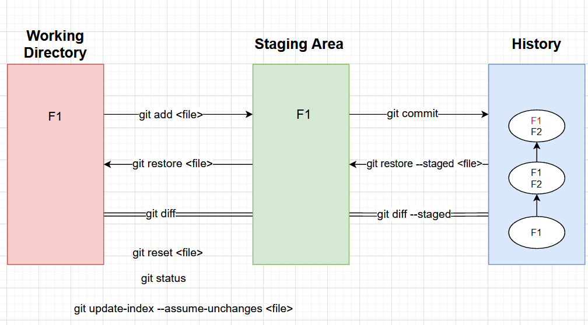

# GIT Working Visualization

 

# Git CLI commands 

| Commands                                                   | Description                                                                          |
|------------------------------------------------------------|--------------------------------------------------------------------------------------|
| `git init`                                                 | initialize a new repo in a directory                                                 |
| `git config --global user.name "name"`                     | `--local` option can be used as well to apply to this repo only                      |
| `git config --global user.email "email"`                   | this config will be used for all commits                                             |
| `git config --list`                                        | lists all config                                                                     |
| `git remote -v`                                            | see what origin points to                                                            |
| `git status`                                               | see the state of files in working tree, staging area vs latest commit in git history |
| `git add ./<filename>`                                     | move file(s) to the staging area                                                     |
| `git commit -m <message>`                                  | commit files added in SA                                                             |
| `git commit -a -m "<message>"`                             | add and commit all modified files                                                    |
| `git log `                                                 | view the git history / git commit graph                                              |
| `git log -- <filename>`                                    | get logs related to specific file                                                    |
| `alias graph="git log --all --decorate --oneline --graph"` | log graph                                                                            |
| `git checkout <commithash> -- <filename>`                  | Retrieves the file from that commit to WD and SA                                     
| `git diff`                                                 | diff of working tree and staging area                                                |
| `git diff --staged`                                        | diff of staging area and latest commit                                               |
| `git rm <filename>`                                        | remove a file from the working tree and the staging area                             |
| `git restore <filename>`                                   | retrieve a file from the staging area into the working tree                          |
| `git restore --staged <filename>`                          | retrieve a file from the latest commit into the staging area                         |
| `git reset <filename>`                                     | Removes file from Satging area to unstagged (WD)                                     |
| `git reset HEAD -- .`                                      | opposite of `git add .` removes everything from staging area                         |
| `git reset --hard`                                         | removes all modified files from SA and WD                                            |
| `git reset --hard origin/<branch>`                         | move head to origin/<branch> removes all local commits |
| `git update-index --assume-unchanged <filename>`           | Untrack a file                                                                       |
| `git update-index --no-assume-unchanged <filename>`        | retrack a file                                                                       |
                         

### References
[video-1](https://www.youtube.com/watch?v=uR6G2v_WsRA&t=867s) 

| Commands                            | Description                                                                             |
|-------------------------------------|-----------------------------------------------------------------------------------------|
| `git log`                           | git history                                                                             |
| `git branch <branch-name>`          | create a branch                                                                         |
| `git checkout <branch-name> `       | checkout a branch/move head pointer                                                     |
| `git commit -a -m "commit message"` | commit all modified and tracked files in on command (bypass separate 'git add' command) |
| `git diff master..SDN `             | diff between 2 branches                                                                 |
| `git merge <feature_branch> `       | merge <feature-branch> to <current> (master) (fast-forward and 3-way merges)            |
| `git branch --merged `              | see branches merged into the current branch                                             |
| `git branch -d <branch-name>`       | delete a branch, only if already merged                                                 |
| `git branch -D (branch-name) `      | delete a branch, including if not already merged (exercise caution here)                |
| `git merge --abort `                | abort a merge during a merge conflict situation                                         |
| `git stash`                         | create a stash point                                                                    |
| `git stash list`                    | list stash points                                                                       |
| `git stash list -p `                | list stash points and show diffs per stash                                              |
| `git stash apply `                  | apply most recent stash                                                                 |
| `git stash pop `                    | apply most recent stash, and remove it from saved stashes                               |
| `git stash apply <stash reference>` | apply a specific stash point                                                            |
| `git stash save "<description>"`    | create a stash point, be more descriptive                                               |
| `git rebase <base-branch>`          | bring commits from base branch and create new commits on top from current branch        |
  

  
### References
[video-2](https://www.youtube.com/watch?v=uR6G2v_WsRA&t=867s) 

|Commands| Description|
|--------|------------|

### Reference
[video-3](https://www.youtube.com/watch?v=uR6G2v_WsRA&t=867s)              

